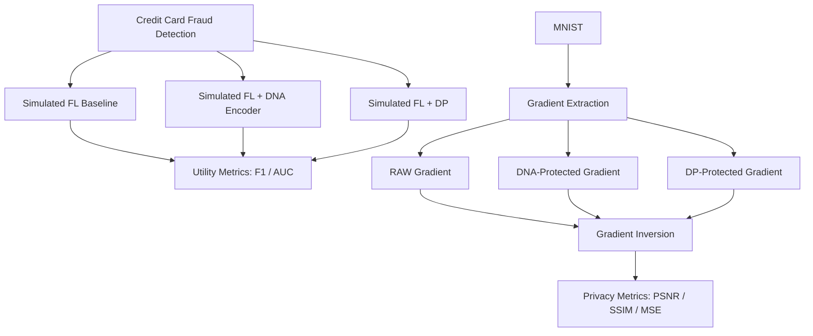

# FL-DNA

## Federated Learning + DNA Encoding for Privacy-Preserving AI Training

FL-DNA is a research prototype for evaluating privacy-preserving techniques in
distributed AI training. The project combines simulated Federated Learning,
DNA-based gradient encoding, AES-256-GCM encryption, Differential Privacy, and
Gradient Inversion Attack evaluation.

The current experiments use Credit Card Fraud Detection to measure model
utility and MNIST to measure reconstruction risk. The main research goal is:

> Evaluate whether DNA-based encoding can protect federated model updates while
> preserving model utility compared to Differential Privacy.

The current Federated Learning workflow is simulated in a single process. A
real Flower-based distributed implementation is planned as a later phase.

## Table of Contents

- [Research Objectives](#research-objectives)
- [Architecture](#architecture)
- [Project Structure](#project-structure)
- [Datasets](#datasets)
- [Implemented Components](#implemented-components)
- [Experiment Results](#experiment-results)
- [Setup](#setup)
- [Running Individual Experiments](#running-individual-experiments)
- [Run the Complete Pipeline](#run-the-complete-pipeline)
- [Output Artifacts](#output-artifacts)
- [Project Workflow](#project-workflow)
- [Important Files](#important-files)
- [Current Limitations](#current-limitations)

## Research Objectives

### RQ1: Gradient Privacy

Can DNA encoding protect gradients against Gradient Inversion Attacks?

### RQ2: Model Utility

What is the impact of DNA protection and Differential Privacy on model utility?

### RQ3: Runtime and Bandwidth

What is the computational and bandwidth overhead introduced by DNA encoding
and AES-256-GCM encryption?

## Architecture

FL-DNA evaluates two complementary experiment tracks:

1. **Credit Card Fraud Detection:** compare Baseline simulated FL, FL with DNA
   protection, and FL with a preliminary Differential Privacy baseline.
2. **MNIST Gradient Reconstruction:** extract one image gradient, create RAW,
   DNA-protected, and DP-protected variants, reconstruct images with a
   lightweight iDLG-style attack, and compare reconstruction quality.

The DNA transformation pipeline is:

```text
float32 tensor
    -> IEEE 754 binary string
    -> DNA symbols (00=A, 01=T, 10=G, 11=C)
    -> AES-256-GCM encrypted payload
    -> authenticated decryption
    -> DNA decoding
    -> bit-exact float32 tensor
```

## Project Structure

```text
FL-DNA/
├── AGENTS.md
├── project.md
├── README.md
├── requirements.txt
├── datasets/
│   ├── MNIST/
│   └── creditcard.csv
├── data/
│   ├── load_creditcard.py
│   └── load_mnist.py
├── models/
│   ├── fraud_mlp.py
│   └── mnist_cnn.py
├── dna_encoder/
│   ├── binary_mapper.py
│   ├── dna_mapper.py
│   ├── aes_crypto.py
│   ├── encoder.py
│   └── test_encoder.py
├── attacks/
│   ├── gradient_extraction.py
│   ├── dna_gradient.py
│   ├── dp_gradient.py
│   ├── gradient_inversion.py
│   └── evaluate_reconstruction.py
├── experiments/
│   ├── run_fraud_fl_baseline.py
│   ├── run_fraud_fl_dna.py
│   ├── run_fraud_fl_dp.py
│   ├── compare_fraud_results.py
│   ├── train_mnist_model.py
│   ├── compare_privacy_results.py
│   ├── benchmark_dna_encoder.py
│   └── run_all_quick.py
├── results/
│   ├── fraud/
│   └── mnist/
└── logs/
```

| Path | Purpose |
| --- | --- |
| `datasets/` | Immutable local datasets. Experiment scripts must not modify these files. |
| `data/` | Cross-platform dataset loaders for Credit Card Fraud Detection and MNIST. |
| `models/` | PyTorch models used by the fraud and MNIST experiments. |
| `dna_encoder/` | DNA encoding, decoding, IEEE 754 conversion, and AES encryption modules. |
| `attacks/` | Gradient extraction, protected gradient generation, reconstruction attack, and metrics. |
| `experiments/` | Training, simulated FL, comparison, benchmark, and end-to-end runner scripts. |
| `results/` | Generated metrics, model checkpoints, gradients, and reconstruction images. |
| `logs/` | Timestamped realtime logs produced by the complete pipeline runner. |

## Datasets

### MNIST

Handwritten digit recognition dataset used to train the CNN and evaluate
Gradient Inversion Attack reconstruction quality.

Expected location:

```text
datasets/MNIST
```

The MNIST loader uses the existing local files with `download=False`.

### Credit Card Fraud Detection

Kaggle fraud detection dataset used for preliminary simulated FL utility
experiments.

Expected location:

```text
datasets/creditcard.csv
```

The target column is `Class`. The loader standardizes `Amount` and `Time`
using training-split statistics only.

## Implemented Components

### DNA Encoder

- IEEE 754 bit-exact NumPy `float32` conversion.
- Binary string serialization and deserialization.
- DNA mapping: `00 -> A`, `01 -> T`, `10 -> G`, `11 -> C`.
- AES-256-GCM authenticated encryption with nonce, tag, and ciphertext.
- Base64 payload encoding for JSON-friendly storage and inspection.
- Unit test and runtime/bandwidth benchmark.

### Simulated Federated Learning

- Three local clients trained in one Python process.
- Sample-count weighted FedAvg aggregation.
- Baseline model update aggregation.
- DNA-protected state dictionary round trip before aggregation.
- Preliminary Differential Privacy baseline with update L2 clipping and
  Gaussian noise.
- F1-score, AUC-ROC, accuracy, precision, and recall evaluation.

### Gradient Inversion Attack

- MNIST CNN with `97.72%` test accuracy in the current checkpoint.
- Batch-size-one gradient extraction from a deterministic MNIST sample.
- RAW, DNA-protected, and DP-protected gradient artifacts.
- Lightweight iDLG-style reconstruction with true-label baseline matching.
- MSE, PSNR, and SSIM evaluation.
- Original, reconstructed, and comparison-grid image artifacts.

## Experiment Results

The tables below reflect the latest saved JSON artifacts. They were refreshed
by **quick mode**, which uses three fraud FL rounds and `500` inversion
iterations. Run the full pipeline to regenerate the full configuration with
five fraud FL rounds and `2,000` inversion iterations.

### Fraud Detection Results

| Method | F1-score | AUC-ROC |
| --- | ---: | ---: |
| Baseline | 0.130882 | 0.981085 |
| DNA | 0.130882 | 0.981085 |
| DP | 0.108108 | 0.976029 |

### Privacy Results

| Method | PSNR | SSIM |
| --- | ---: | ---: |
| RAW | 6.026153 | 0.106586 |
| DNA | 6.026153 | 0.106586 |
| DP | 5.877423 | 0.081636 |

RAW and DNA results match because DNA encode/decode is bit-exact. DP changes
the gradient through clipping and Gaussian noise, which reduces reconstruction
quality in the current preliminary evaluation.

## Setup

### Create a Virtual Environment

#### Windows

```bash
python -m venv venv
venv\Scripts\activate
```

#### macOS / Linux

```bash
python3 -m venv venv
source venv/bin/activate
```

### Install Dependencies

```bash
pip install -r requirements.txt
```

## Running Individual Experiments

Run commands from the `FL-DNA/` project root.

### DNA Encoder Test

```bash
python dna_encoder/test_encoder.py
```

### DNA Encoder Benchmark

```bash
python experiments/benchmark_dna_encoder.py
```

### Fraud Baseline

```bash
python experiments/run_fraud_fl_baseline.py
```

### Fraud DNA

```bash
python experiments/run_fraud_fl_dna.py
```

### Fraud DP

```bash
python experiments/run_fraud_fl_dp.py
```

### Fraud Result Comparison

```bash
python experiments/compare_fraud_results.py
```

### MNIST Training

```bash
python experiments/train_mnist_model.py
```

### Gradient Extraction

```bash
python attacks/gradient_extraction.py
python attacks/dna_gradient.py
python attacks/dp_gradient.py
```

### Gradient Inversion

```bash
python attacks/gradient_inversion.py
python attacks/evaluate_reconstruction.py
python experiments/compare_privacy_results.py
```

## Run the Complete Pipeline

The complete runner executes all preliminary experiments in order, prints each
subprocess output in realtime, and saves the same output to a timestamped log.

### Quick Mode

```bash
python experiments/run_all_quick.py --quick
```

Quick mode uses reduced rounds and iterations for faster testing:

- Fraud simulated FL: `3` rounds.
- Gradient inversion: `500` iterations.

### Full Mode

```bash
python experiments/run_all_quick.py
```

Full mode uses the complete experiment configuration:

- Fraud simulated FL: `5` rounds.
- Gradient inversion: `2,000` iterations.

## Output Artifacts

### Fraud Results

Generated under `results/fraud/`:

```text
baseline_metrics.json
dna_metrics.json
dp_metrics.json
comparison_summary.json
```

### MNIST Results

Generated under `results/mnist/`:

```text
base_model.pt
train_metrics.json
raw_gradient.pt
dna_gradient.pt
dp_gradient.pt
reconstruction_metrics.json
privacy_summary.json
reconstructions/
├── original.png
├── reconstructed_raw.png
├── reconstructed_dna.png
├── reconstructed_dp.png
└── comparison_grid.png
```

### Pipeline Logs

Generated under `logs/`:

```text
run_<timestamp>.log
```

Each log includes step headers, realtime subprocess output, runtime per step,
failure details if applicable, and the final result summary.

## Project Workflow



## Maintainer Notes

Local maintainer notes and AI-agent progress files are intentionally excluded
from the public repository.

## Current Limitations

- Federated Learning is currently simulated in one process. Flower integration
  is planned as a later phase.
- The DP implementation is a controlled baseline based on clipping and
  Gaussian noise, not a complete privacy-accounting implementation.
- The lightweight iDLG-style reconstruction is a reproducible baseline, not a
  state-of-the-art attack.
- Quick mode intentionally produces lower-quality reconstruction artifacts than
  full mode because it reduces optimization iterations.
