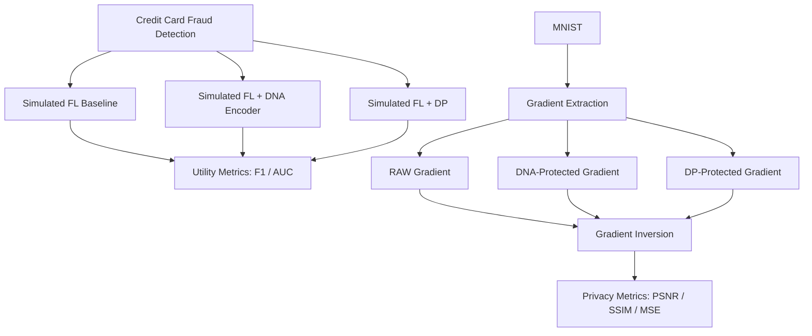

# FL-DNA

## Federated Learning + DNA Encoding for Privacy-Preserving AI Training

FL-DNA is a research prototype for evaluating privacy-preserving techniques in
distributed AI training. The project combines simulated Federated Learning,
DNA-based gradient encoding, AES-256-GCM encryption, Differential Privacy, and
Gradient Inversion Attack evaluation.

The current experiments use Credit Card Fraud Detection to measure model
utility and MNIST to measure reconstruction risk. The main research goal is:

> Evaluate whether DNA-based encoding can protect federated model updates while
> preserving model utility compared to Differential Privacy.

The implementation is located in [`FL-DNA/`](FL-DNA/). The current Federated
Learning workflow is simulated in a single process. A real Flower-based
distributed implementation is planned as a later phase.

## Table of Contents

- [Research Objectives](#research-objectives)
- [Architecture](#architecture)
- [Repository Structure](#repository-structure)
- [Datasets](#datasets)
- [Implemented Components](#implemented-components)
- [Experiment Results](#experiment-results)
- [Setup](#setup)
- [Running Individual Experiments](#running-individual-experiments)
- [Run the Complete Pipeline](#run-the-complete-pipeline)
- [Output Artifacts](#output-artifacts)
- [Project Workflow](#project-workflow)
- [Important Files](#important-files)
- [Current Limitations](#current-limitations)

## Research Objectives

### RQ1: Gradient Privacy

Can DNA encoding protect gradients against Gradient Inversion Attacks?

### RQ2: Model Utility

What is the impact of DNA protection and Differential Privacy on model utility?

### RQ3: Runtime and Bandwidth

What is the computational and bandwidth overhead introduced by DNA encoding
and AES-256-GCM encryption?

## Architecture

FL-DNA evaluates two complementary experiment tracks:

1. **Credit Card Fraud Detection:** compare Baseline simulated FL, FL with DNA
   protection, and FL with a preliminary Differential Privacy baseline.
2. **MNIST Gradient Reconstruction:** extract one image gradient, create RAW,
   DNA-protected, and DP-protected variants, reconstruct images with a
   lightweight iDLG-style attack, and compare reconstruction quality.

The DNA transformation pipeline is:

```text
float32 tensor
    -> IEEE 754 binary string
    -> DNA symbols (00=A, 01=T, 10=G, 11=C)
    -> AES-256-GCM encrypted payload
    -> authenticated decryption
    -> DNA decoding
    -> bit-exact float32 tensor
```

## Repository Structure

```text
Capstone/
├── README.md
└── FL-DNA/
    ├── README.md
    ├── requirements.txt
    ├── datasets/
    │   ├── MNIST/
    │   └── creditcard.csv
    ├── data/
    ├── models/
    ├── dna_encoder/
    ├── attacks/
    ├── experiments/
    ├── results/
    └── logs/
```

| Path | Purpose |
| --- | --- |
| `FL-DNA/datasets/` | Immutable local datasets. Experiment scripts must not modify these files. |
| `FL-DNA/data/` | Cross-platform dataset loaders for Credit Card Fraud Detection and MNIST. |
| `FL-DNA/models/` | PyTorch models used by fraud and MNIST experiments. |
| `FL-DNA/dna_encoder/` | DNA encoding, decoding, IEEE 754 conversion, and AES encryption modules. |
| `FL-DNA/attacks/` | Gradient extraction, protected gradients, reconstruction attack, and metrics. |
| `FL-DNA/experiments/` | Training, simulated FL, comparisons, benchmarks, and pipeline runner. |
| `FL-DNA/results/` | Generated metrics, model checkpoints, gradients, and reconstruction images. |
| `FL-DNA/logs/` | Timestamped realtime logs produced by the complete pipeline runner. |

## Datasets

Datasets are intentionally excluded from Git. Place them locally before
running experiments.

### MNIST

Handwritten digit recognition dataset used for CNN training and Gradient
Inversion Attack evaluation.

```text
FL-DNA/datasets/MNIST
```

### Credit Card Fraud Detection

Kaggle fraud detection dataset used for preliminary simulated FL utility
experiments.

```text
FL-DNA/datasets/creditcard.csv
```

## Implemented Components

### DNA Encoder

- IEEE 754 bit-exact NumPy `float32` conversion.
- Binary serialization and DNA mapping: `00 -> A`, `01 -> T`, `10 -> G`,
  `11 -> C`.
- AES-256-GCM authenticated encryption.
- Unit test and runtime/bandwidth benchmark.

### Simulated Federated Learning

- Three clients trained in one Python process.
- Sample-count weighted FedAvg aggregation.
- Baseline, DNA-protected, and Differential Privacy variants.
- F1-score, AUC-ROC, accuracy, precision, and recall evaluation.

### Gradient Inversion Attack

- MNIST CNN with `97.72%` test accuracy in the current checkpoint.
- Batch-size-one gradient extraction.
- RAW, DNA-protected, and DP-protected gradient variants.
- Lightweight iDLG-style image reconstruction.
- MSE, PSNR, and SSIM evaluation.

## Experiment Results

The tables reflect the latest committed quick-mode artifacts. Quick mode uses
three fraud FL rounds and `500` inversion iterations. Full mode uses five
rounds and `2,000` inversion iterations.

### Fraud Detection Results

| Method | F1-score | AUC-ROC |
| --- | ---: | ---: |
| Baseline | 0.130882 | 0.981085 |
| DNA | 0.130882 | 0.981085 |
| DP | 0.108108 | 0.976029 |

### Privacy Results

| Method | PSNR | SSIM |
| --- | ---: | ---: |
| RAW | 6.026153 | 0.106586 |
| DNA | 6.026153 | 0.106586 |
| DP | 5.877423 | 0.081636 |

RAW and DNA results match because DNA encode/decode preserves gradient bits.
DP modifies gradients through clipping and Gaussian noise.

## Setup

Clone the repository and enter the implementation directory:

```bash
git clone https://github.com/manhquang04/Capstone.git
cd Capstone/FL-DNA
```

### Create a Virtual Environment

#### Windows

```bash
python -m venv venv
venv\Scripts\activate
```

#### macOS / Linux

```bash
python3 -m venv venv
source venv/bin/activate
```

### Install Dependencies

```bash
pip install -r requirements.txt
```

## Running Individual Experiments

Run commands from the `FL-DNA/` directory.

### DNA Encoder Test

```bash
python dna_encoder/test_encoder.py
```

### Fraud Experiments

```bash
python experiments/run_fraud_fl_baseline.py
python experiments/run_fraud_fl_dna.py
python experiments/run_fraud_fl_dp.py
python experiments/compare_fraud_results.py
```

### MNIST Training and Privacy Evaluation

```bash
python experiments/train_mnist_model.py
python attacks/gradient_extraction.py
python attacks/dna_gradient.py
python attacks/dp_gradient.py
python attacks/gradient_inversion.py
python attacks/evaluate_reconstruction.py
python experiments/compare_privacy_results.py
```

## Run the Complete Pipeline

### Quick Mode

```bash
python experiments/run_all_quick.py --quick
```

Quick mode uses reduced rounds and iterations for faster testing.

### Full Mode

```bash
python experiments/run_all_quick.py
```

Full mode runs the complete experiment configuration.

## Output Artifacts

### Fraud Results

```text
FL-DNA/results/fraud/
├── baseline_metrics.json
├── dna_metrics.json
├── dp_metrics.json
└── comparison_summary.json
```

### MNIST Results

```text
FL-DNA/results/mnist/
├── base_model.pt
├── reconstruction_metrics.json
├── privacy_summary.json
└── reconstructions/
    ├── original.png
    ├── reconstructed_raw.png
    ├── reconstructed_dna.png
    ├── reconstructed_dp.png
    └── comparison_grid.png
```

### Pipeline Logs

```text
FL-DNA/logs/run_<timestamp>.log
```

## Project Workflow



## Important Files

### [`FL-DNA/README.md`](FL-DNA/README.md)

Detailed documentation for the implementation directory.

Local maintainer notes and AI-agent progress files are intentionally excluded
from the public repository.

## Current Limitations

- Federated Learning is currently simulated in one process. Flower integration
  is planned as a later phase.
- The DP implementation is a controlled baseline, not a complete
  privacy-accounting implementation.
- The lightweight iDLG-style reconstruction is a reproducible baseline, not a
  state-of-the-art attack.
