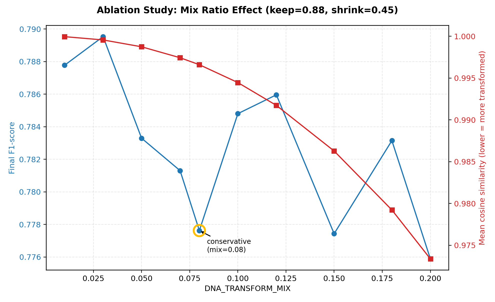
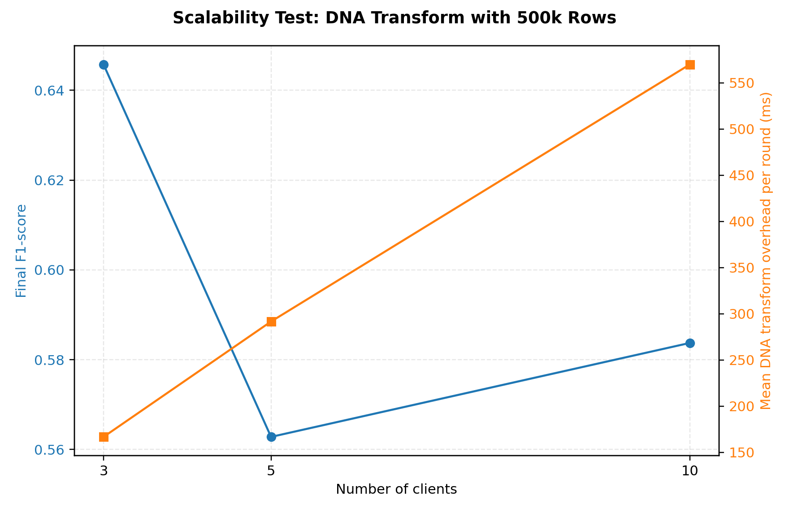
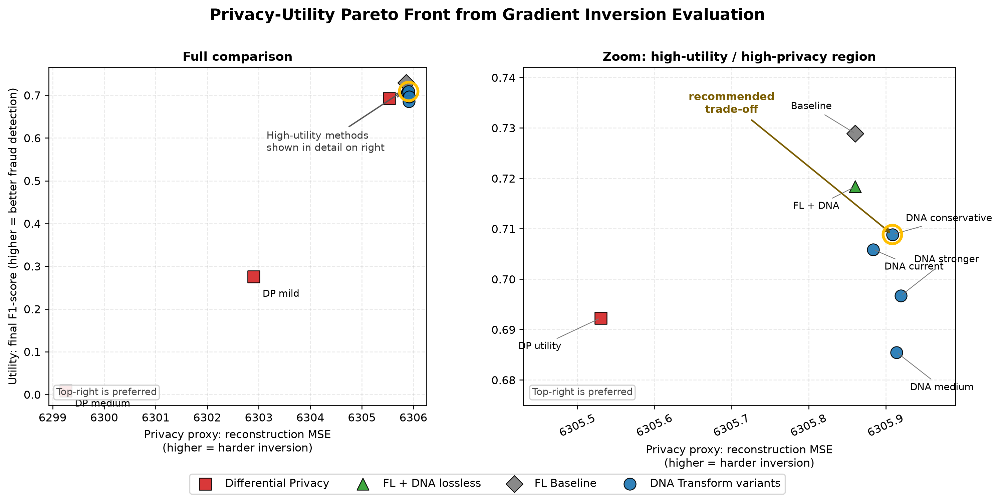

# FL-DNA: A DNA-Based Update Transformation Defense Against Gradient Inversion Attacks in Federated Fraud Detection

This repository contains a research prototype for fraud detection on a PaySim-style tabular dataset using Federated Learning (FL), DNA-based model-update encoding, Differential Privacy-style noise defenses, Secure Aggregation simulation, and gradient inversion attack evaluation.

The goal is not to build a production privacy system. The goal is to provide a clean, reproducible experiment package that can support a research comparison between:

- Centralized MLP as the upper bound.
- FL Baseline as the federated learning reference.
- FL + DNA as lossless communication/update encoding.
- FL + DP-style clipping/noise as a traditional privacy baseline.
- FL + Secure Aggregation as a communication-layer privacy mechanism.
- FL + DNA Transform Defense as a DNA-centered update transformation.
- FL + DNA Transform + Secure Aggregation as a hybrid update-protection configuration for evaluation.

The main code lives in [`FL-DNA/`](FL-DNA/). The dataset file is expected at:

```text
FL-DNA/datasets/creditcard.csv
```

The loader treats this file as a PaySim-style fraud dataset with the following schema:

```text
step, type, amount, oldbalanceOrg, newbalanceOrig,
oldbalanceDest, newbalanceDest, isFraud
```

High-cardinality identity columns such as `nameOrig` and `nameDest` are excluded. `isFlaggedFraud` is also excluded because it is a simulator rule flag and can leak rule-based information into the model.

## Project Structure

```text
FL-DNA/
|-- data/
|   `-- load_creditcard.py
|-- models/
|   `-- fraud_mlp.py
|-- dna_encoder/
|   |-- aes_crypto.py
|   |-- binary_mapper.py
|   |-- dna_mapper.py
|   |-- encoder.py
|   `-- transform_defense.py
|-- privacy/
|   |-- dp_config.py
|   |-- dp_engine.py
|   `-- secure_agg.py
|-- attacks/
|   |-- attack_runner.py
|   |-- gradient_inversion.py
|   |-- inversion_metrics.py
|   `-- pseudo_image.py
|-- experiments/
|   |-- fraud_fl_common.py
|   |-- run_fraud_centralized.py
|   |-- run_fraud_fl_baseline.py
|   |-- run_fraud_fl_dna.py
|   |-- run_fraud_fl_dp.py
|   |-- run_fraud_fl_dna_dp.py
|   |-- run_fraud_fl_secureagg.py
|   |-- run_fraud_fl_dna_secureagg.py
|   |-- run_fraud_fl_dna_transform.py
|   |-- run_fraud_fl_dna_transform_secureagg.py
|   |-- compare_fraud_results.py
|   |-- run_attack_sweep.py
|   |-- compare_attack_sweeps.py
|   `-- run_all_quick.py
|-- results/
|   `-- fraud/
`-- artifacts/
    `-- gradient_inversion/
```

## High-Level Architecture

The shared fraud detection pipeline is:

```text
PaySim-style CSV
  -> feature selection
  -> feature engineering
  -> RobustScaler for numeric features
  -> one-hot encoding for transaction type
  -> stratified train / validation / test split
  -> mild non-IID client partition
  -> local MLP training
  -> FedAvg aggregation
  -> validation threshold tuning
  -> test-set evaluation
```

The same preprocessing, model backbone, loss, threshold tuning, random seed, and FL configuration are used across comparable FL variants. This is important because the paper comparison should isolate only the update-protection mechanism.

## Dataset and Preprocessing

The selected input columns are:

```text
step
type
amount
oldbalanceOrg
newbalanceOrig
oldbalanceDest
newbalanceDest
```

The target column is:

```text
isFraud
```

Additional engineered features:

```text
balance_diff_orig = oldbalanceOrg - newbalanceOrig
balance_diff_dest = newbalanceDest - oldbalanceDest
```

Preprocessing decisions:

- `type` is one-hot encoded.
- Numeric features are scaled using `RobustScaler`.
- Missing values are handled by the data loading pipeline.
- Train, validation, and test splits are stratified to preserve the fraud ratio.
- FL clients use a mild non-IID split without label collapse. Every client keeps fraud samples.

Current non-IID diagnostics:

```text
client_sample_counts = [132143, 118991, 73866]
client_fraud_rates   = [0.001059, 0.001177, 0.001882]
```

## Model Backbone

All experiments use the same tabular MLP:

```text
input
-> Linear 128 + BatchNorm + ReLU + Dropout
-> Linear 64  + BatchNorm + ReLU + Dropout
-> Linear 32  + BatchNorm + ReLU + Dropout
-> Linear 1 logits
```

The default loss is binary focal loss:

```text
alpha = 0.95
gamma = 2.0
```

This is used because PaySim fraud detection is highly imbalanced. The code also supports `LOSS_TYPE=weighted_bce` for ablation, but the accepted main results use focal loss.

The model outputs logits. Evaluation applies sigmoid and then uses validation-based threshold tuning. The final threshold is not fixed at `0.5`; it is selected to maximize validation F1.

## Federated Learning Setup

The official FL comparison uses:

```text
num_clients = 3
num_rounds = 50
local_epochs = 1
aggregation = FedAvg
optimizer = Adam
loss = focal loss
max_rows = 500000
```

All main FL variants in the official comparison use the same `NUM_ROUNDS=50`. Artifacts with mismatched round counts are kept only as diagnostic or appendix evidence and are not mixed into the official table.

## Methods

### 1. Centralized MLP

The centralized model trains on the pooled training data. It is used as the upper-bound reference for utility. It does not use FL, DNA, DP, or Secure Aggregation.

### 2. FL Baseline

The FL baseline trains the same MLP across 3 clients and aggregates client models using FedAvg. It measures the cost of moving from centralized training to federated training.

Flow:

```text
global model
  -> send to clients
  -> local training
  -> client model updates
  -> FedAvg
  -> updated global model
```

### 3. FL + DNA Encode/Decode

This variant applies DNA encoding only to model updates after local training. Raw input features are not encoded.

Flow:

```text
local model update
  -> float32 bytes
  -> binary representation
  -> DNA nucleotide mapping
  -> AES-256-GCM encrypted payload
  -> decrypt
  -> DNA decode
  -> restored float32 update
  -> FedAvg
```

This path is designed to be lossless or near bit-exact. Therefore, it should preserve utility, but it should not be presented as a strong privacy defense against gradient inversion by itself.

### 4. FL + DP-Style Clipping and Noise

This variant applies client-update clipping and Gaussian noise before aggregation.

Flow:

```text
local model update
  -> full-update L2 clipping
  -> Gaussian noise
  -> FedAvg
```

Available DP noise presets:

```text
utility = 0.0001
weak    = 0.0005
mild    = 0.001
medium  = 0.005
strong  = 0.01
```

Important limitation: this repository does not implement a privacy accountant. Therefore, these runs must be reported as clipping/noise defenses, not as formal `(epsilon, delta)` Differential Privacy.

### 5. FL + DNA + DP

This hybrid applies clipping/noise first, then uses DNA encode/decode to transport the protected update.

Flow:

```text
local model update
  -> DP-style clipping and Gaussian noise
  -> DNA encode/decode communication path
  -> FedAvg
```

The interpretation is:

- DP-style noise provides the privacy perturbation.
- DNA provides update transport/representation protection.

### 6. FL + Secure Aggregation

Secure Aggregation is implemented as a research simulation, not production MPC.

Flow:

```text
local model update
  -> pairwise random masks across clients
  -> server receives masked weighted updates
  -> masks cancel in aggregate
  -> server applies only the aggregate update
```

The server does not directly observe individual client updates under this threat model. Secure Aggregation does not add noise, so it usually preserves utility better than strong DP-style noise.

Secure Aggregation mask seeds are generated dynamically. Each run records `secure_agg_run_seed`, and each round logs `secure_agg_round_seed` in the output JSON. This keeps the mask simulation reproducible without using a hardcoded source seed in the defense path.

### 7. FL + DNA + Secure Aggregation

This combines DNA lossless update transport with Secure Aggregation. In the current accepted results, `FL_DNA_SecureAgg` is numerically identical to `FL_SecureAgg` on core utility metrics.

Interpretation: this should be treated as lossless DNA transport or overhead analysis after Secure Aggregation, not as a separate stronger privacy defense.

### 8. FL + DNA Transform Defense

This is the main DNA-centered defense prototype. Unlike DNA encode/decode, it changes the numeric update before aggregation.

Flow:

```text
local model update
  -> flatten into fixed-size blocks
  -> map block content to binary and DNA sequence
  -> generate dynamic client-round transform seed
  -> derive DNA-sequence-based block seed
  -> sequence-seeded permutation
  -> selective low-energy attenuation
  -> residual mixing into numeric update
  -> FedAvg
```

The purpose is to weaken the direct relationship between the raw local update and the update observed by an attacker, while keeping the transformed update usable for model training.

The Transform Defense no longer relies on a fixed hardcoded base seed. Each run generates a fresh `dna_transform_run_seed` from secure randomness unless `DNA_TRANSFORM_RUN_SEED` is explicitly provided. The experiment then derives deterministic client-round seeds from that recorded run seed. Metrics artifacts log the run seed and per-round `dna_transform_client_seeds` so a run can be reproduced later.

Main transform configurations:

```text
current:      mix=0.05, keep=0.90, shrink=0.50
conservative: mix=0.08, keep=0.88, shrink=0.45
medium:       mix=0.10, keep=0.85, shrink=0.40
stronger:     mix=0.12, keep=0.82, shrink=0.35
```

The current recommendation is the `conservative` variant because it provides the best utility/privacy balance among the accepted 50-round artifacts.

### 9. FL + DNA Transform + Secure Aggregation

This combines the DNA-centered update transformation with Secure Aggregation.

Interpretation:

- DNA Transform changes the update representation before communication.
- Secure Aggregation hides individual client updates from a server-side observer.
- This is the strongest current research story in the prototype, but it is still not a formal DP guarantee.

## Gradient Inversion Attack Evaluation

The attack module evaluates reconstruction risk using a known-label gradient matching attack.

Attack protocol:

```text
same PaySim preprocessing
same FraudMLP backbone
same selected validation fraud samples
known-label gradient matching
300 Adam iterations
batch size = 1
```

PaySim is tabular, not image data. To compute PSNR and SSIM, the code converts normalized feature vectors into deterministic pseudo-images. These visual metrics are useful for secondary comparison only.

For tabular privacy interpretation, prioritize:

- Feature MSE
- Cosine similarity
- Pearson correlation
- Sign-match ratio

PSNR and SSIM are reported as secondary pseudo-image reconstruction metrics.

Secure Aggregation rows are handled separately:

- Under the true server-side threat model, individual raw updates are not visible, so sample-level individual-update inversion is not directly applicable.
- Pre-aggregation leakage rows are analysis-only upper bounds for the case where individual updates leak before aggregation.

## Installation

Create or use the project virtual environment, then install requirements:

```bash
cd /Users/manhquang/Documents/UNIVERSITY/Capstone/FL-DNA
../venv/bin/python -m pip install -r requirements.txt
```

If you use another Python environment, replace `../venv/bin/python` with your Python executable.

## Quick Run

Use quick mode for a smoke test:

```bash
cd /Users/manhquang/Documents/UNIVERSITY/Capstone/FL-DNA
../venv/bin/python experiments/run_all_quick.py --quick
```

Quick mode sets:

```text
QUICK=1
MAX_ROWS=500000
NUM_ROUNDS=3
LOCAL_EPOCHS=1
```

Quick mode is for checking that the pipeline runs. It is not the official paper setting.

## Official 50-Round Run Commands

Run these commands from `FL-DNA/`.

```bash
NUM_ROUNDS=50 LOCAL_EPOCHS=1 MAX_ROWS=500000 LOSS_TYPE=focal ../venv/bin/python experiments/run_fraud_centralized.py
NUM_ROUNDS=50 LOCAL_EPOCHS=1 MAX_ROWS=500000 LOSS_TYPE=focal ../venv/bin/python experiments/run_fraud_fl_baseline.py
NUM_ROUNDS=50 LOCAL_EPOCHS=1 MAX_ROWS=500000 LOSS_TYPE=focal ../venv/bin/python experiments/run_fraud_fl_dna.py

NUM_ROUNDS=50 LOCAL_EPOCHS=1 MAX_ROWS=500000 LOSS_TYPE=focal DP_CLIP_NORM=100 DP_NOISE_PRESET=utility DP_OUTPUT_PATH=results/fraud/dp_utility_metrics.json ../venv/bin/python experiments/run_fraud_fl_dp.py
NUM_ROUNDS=50 LOCAL_EPOCHS=1 MAX_ROWS=500000 LOSS_TYPE=focal DP_CLIP_NORM=100 DP_NOISE_PRESET=mild DP_OUTPUT_PATH=results/fraud/dp_mild_metrics.json ../venv/bin/python experiments/run_fraud_fl_dp.py
NUM_ROUNDS=50 LOCAL_EPOCHS=1 MAX_ROWS=500000 LOSS_TYPE=focal DP_CLIP_NORM=100 DP_NOISE_PRESET=medium DP_OUTPUT_PATH=results/fraud/dp_metrics.json ../venv/bin/python experiments/run_fraud_fl_dp.py

NUM_ROUNDS=50 LOCAL_EPOCHS=1 MAX_ROWS=500000 LOSS_TYPE=focal ../venv/bin/python experiments/run_fraud_fl_secureagg.py
NUM_ROUNDS=50 LOCAL_EPOCHS=1 MAX_ROWS=500000 LOSS_TYPE=focal ../venv/bin/python experiments/run_fraud_fl_dna_secureagg.py

NUM_ROUNDS=50 LOCAL_EPOCHS=1 MAX_ROWS=500000 LOSS_TYPE=focal DNA_TRANSFORM_MIX=0.05 DNA_TRANSFORM_KEEP=0.90 DNA_TRANSFORM_SHRINK=0.50 DNA_TRANSFORM_OUTPUT_PATH=results/fraud/dna_transform_metrics.json ../venv/bin/python experiments/run_fraud_fl_dna_transform.py
NUM_ROUNDS=50 LOCAL_EPOCHS=1 MAX_ROWS=500000 LOSS_TYPE=focal DNA_TRANSFORM_MIX=0.08 DNA_TRANSFORM_KEEP=0.88 DNA_TRANSFORM_SHRINK=0.45 DNA_TRANSFORM_OUTPUT_PATH=results/fraud/dna_transform_conservative_metrics.json ../venv/bin/python experiments/run_fraud_fl_dna_transform.py
NUM_ROUNDS=50 LOCAL_EPOCHS=1 MAX_ROWS=500000 LOSS_TYPE=focal DNA_TRANSFORM_MIX=0.10 DNA_TRANSFORM_KEEP=0.85 DNA_TRANSFORM_SHRINK=0.40 DNA_TRANSFORM_OUTPUT_PATH=results/fraud/dna_transform_medium_metrics.json ../venv/bin/python experiments/run_fraud_fl_dna_transform.py
NUM_ROUNDS=50 LOCAL_EPOCHS=1 MAX_ROWS=500000 LOSS_TYPE=focal DNA_TRANSFORM_MIX=0.12 DNA_TRANSFORM_KEEP=0.82 DNA_TRANSFORM_SHRINK=0.35 DNA_TRANSFORM_OUTPUT_PATH=results/fraud/dna_transform_stronger_metrics.json ../venv/bin/python experiments/run_fraud_fl_dna_transform.py

NUM_ROUNDS=50 LOCAL_EPOCHS=1 MAX_ROWS=500000 LOSS_TYPE=focal DNA_TRANSFORM_MIX=0.05 DNA_TRANSFORM_KEEP=0.90 DNA_TRANSFORM_SHRINK=0.50 DNA_TRANSFORM_SECUREAGG_OUTPUT_PATH=results/fraud/dna_transform_secureagg_metrics.json ../venv/bin/python experiments/run_fraud_fl_dna_transform_secureagg.py

../venv/bin/python experiments/compare_fraud_results.py
```

Omit `MAX_ROWS` if you want to run on the full CSV.

For exact reproducibility of a new dynamic-seed defense run, copy the logged `dna_transform_run_seed` and/or `secure_agg_run_seed` from the generated JSON and pass them back as environment variables:

```bash
DNA_TRANSFORM_RUN_SEED=<logged_seed> SECURE_AGG_RUN_SEED=<logged_seed> ...
```

## Attack Evaluation Commands

Run the main gradient inversion evaluation:

```bash
ATTACK_NUM_SAMPLES=10 ATTACK_ITERATIONS=300 ATTACK_WARMUP_ROUNDS=3 MAX_ROWS=500000 ../venv/bin/python attacks/attack_runner.py
```

Run all attack sweeps and generate compact comparison reports:

```bash
../venv/bin/python experiments/run_attack_sweep.py --mode all --iterations 300 --max-rows 500000
../venv/bin/python experiments/compare_attack_sweeps.py
```

Important attack outputs:

```text
artifacts/gradient_inversion/metrics_summary.csv
artifacts/gradient_inversion/metrics_summary.json
artifacts/gradient_inversion/metrics_details.json
artifacts/gradient_inversion/metrics_by_strength.csv
artifacts/gradient_inversion/metrics_by_sample_count.csv
artifacts/gradient_inversion/metrics_by_round.csv
artifacts/gradient_inversion/metrics_by_round_group.csv
artifacts/gradient_inversion/metrics_by_dp_noise.csv
artifacts/gradient_inversion/privacy_utility_tradeoff.csv
artifacts/gradient_inversion/sweep_report.json
```

## Accepted 50-Round Utility Results

The official accepted comparison is saved in:

```text
FL-DNA/results/fraud/comparison_summary.json
```

It uses:

```text
target_rounds = 50
max_rows = 500000
loss = focal
local_epochs = 1
num_clients = 3
```

These are saved accepted artifacts. After the dynamic seed update, new TransformDefense or SecureAgg reruns will not silently reuse the old fixed defense seed; they will generate and log fresh defense seeds. Reproduce a specific new run by reusing the logged seed values.

Final-round utility metrics:

| Method | F1 | ROC-AUC | PR-AUC | Precision | Recall |
|---|---:|---:|---:|---:|---:|
| Centralized | 0.7302 | 0.9944 | 0.7731 | 0.7480 | 0.7132 |
| FL Baseline | 0.7289 | 0.9912 | 0.7144 | 0.8542 | 0.6357 |
| FL DNA | 0.7184 | 0.9907 | 0.7172 | 0.7586 | 0.6822 |
| FL DP utility | 0.6923 | 0.9897 | 0.6921 | 0.7714 | 0.6279 |
| FL DP mild | 0.2756 | 0.9206 | 0.2091 | 0.3229 | 0.2403 |
| FL DP medium | 0.0083 | 0.7891 | 0.0037 | 0.0042 | 0.7752 |
| FL SecureAgg | 0.7119 | 0.9906 | 0.7118 | 0.7850 | 0.6512 |
| FL DNA SecureAgg | 0.7119 | 0.9906 | 0.7118 | 0.7850 | 0.6512 |
| DNA Transform current | 0.7059 | 0.9912 | 0.7131 | 0.7706 | 0.6512 |
| DNA Transform conservative | 0.7089 | 0.9900 | 0.7160 | 0.7778 | 0.6512 |
| DNA Transform medium | 0.6855 | 0.9910 | 0.7061 | 0.7143 | 0.6589 |
| DNA Transform stronger | 0.6967 | 0.9904 | 0.7116 | 0.7391 | 0.6589 |
| DNA Transform + SecureAgg | 0.7124 | 0.9907 | 0.7120 | 0.7981 | 0.6434 |

Final confusion matrix values:

| Method | TN | FP | FN | TP |
|---|---:|---:|---:|---:|
| Centralized | 99841 | 31 | 37 | 92 |
| FL Baseline | 99858 | 14 | 47 | 82 |
| FL DNA | 99844 | 28 | 41 | 88 |
| FL DP utility | 99848 | 24 | 48 | 81 |
| FL DP mild | 99807 | 65 | 98 | 31 |
| FL DP medium | 76066 | 23806 | 29 | 100 |
| FL SecureAgg | 99849 | 23 | 45 | 84 |
| FL DNA SecureAgg | 99849 | 23 | 45 | 84 |
| DNA Transform conservative | 99848 | 24 | 45 | 84 |

Utility interpretation:

- Centralized MLP is the expected upper bound.
- FL Baseline is close to Centralized, showing that the FL setup is viable.
- FL DNA preserves utility well because the update transport is lossless.
- FL SecureAgg also preserves utility because it hides individual updates without adding noise.
- FL DNA SecureAgg is numerically identical to FL SecureAgg in the accepted artifacts, so it should be treated as lossless transport or overhead analysis.
- DP utility keeps acceptable utility, but stronger DP-style noise quickly degrades the classifier.
- DNA Transform conservative is the best current DNA Transform utility/privacy trade-off.

## Accepted Gradient Inversion Results

Main attack summary:

```text
FL-DNA/artifacts/gradient_inversion/metrics_summary.csv
```

The current accepted attack evaluation uses 10 samples.

| Method | Applicability | n | Feature MSE mean | Cosine | Pearson | Sign-match | PSNR | SSIM |
|---|---|---:|---:|---:|---:|---:|---:|---:|
| FL Baseline | direct server-side | 10 | 6305.86 | 0.5791 | 0.6417 | 0.5692 | 15.3504 | 0.3474 |
| FL DNA | direct server-side | 10 | 6305.86 | 0.5791 | 0.6417 | 0.5692 | 15.3504 | 0.3474 |
| FL DP | direct server-side | 10 | 6299.26 | 0.3878 | 0.4373 | 0.4769 | 11.8857 | 0.1930 |
| DNA Transform | direct server-side | 10 | 6305.88 | 0.5646 | 0.6301 | 0.5462 | 14.9589 | 0.3353 |
| FL SecureAgg | not directly applicable | 10 | - | - | - | - | - | - |
| FL DNA SecureAgg | not directly applicable | 10 | - | - | - | - | - | - |
| DNA Transform + SecureAgg | not directly applicable | 10 | - | - | - | - | - | - |
| FL PreAggregationLeakage | analysis only | 10 | 6323.55 | 0.5942 | 0.6635 | 0.5231 | 15.8328 | 0.3702 |
| DNA PreAggregationLeakage | analysis only | 10 | 6323.55 | 0.5942 | 0.6635 | 0.5231 | 15.8328 | 0.3702 |
| DNA Transform PreAggregationLeakage | analysis only | 10 | 6323.59 | 0.5715 | 0.6397 | 0.5154 | 15.3553 | 0.3434 |

Attack interpretation:

- DNA encode/decode alone does not reduce reconstruction risk in the raw-visible setting because it restores the update almost exactly.
- DNA Transform slightly lowers cosine, Pearson, sign-match, PSNR, and SSIM compared with FL Baseline.
- DP medium reduces reconstruction similarity much more strongly, but its utility collapses.
- Secure Aggregation changes the threat model: the server does not see individual client updates, so direct individual-update inversion is not applicable.

## Privacy-Utility Trade-Off Summary

The accepted trade-off report is saved in:

```text
FL-DNA/artifacts/gradient_inversion/privacy_utility_tradeoff.csv
```

| Family | Variant | Utility rounds | F1 | PR-AUC | Feature MSE | Cosine | Pearson | Sign-match | SSIM | Limitation |
|---|---|---:|---:|---:|---:|---:|---:|---:|---:|---|
| DNA Transform | current | 50 | 0.7059 | 0.7131 | 6305.88 | 0.5646 | 0.6301 | 0.5462 | 0.3353 | |
| DNA Transform | conservative | 50 | 0.7089 | 0.7160 | 6305.91 | 0.5543 | 0.6209 | 0.5462 | 0.3251 | |
| DNA Transform | medium | 50 | 0.6855 | 0.7061 | 6305.91 | 0.5503 | 0.6172 | 0.5462 | 0.3185 | |
| DNA Transform | stronger | 50 | 0.6967 | 0.7116 | 6305.92 | 0.5484 | 0.6151 | 0.5385 | 0.3152 | |
| DP noise | utility | 50 | 0.6923 | 0.6921 | 6305.53 | 0.6036 | 0.6655 | 0.5846 | 0.3676 | |
| DP noise | weak | - | - | - | 6304.40 | 0.5770 | 0.6349 | 0.5154 | 0.3472 | Missing matching utility artifact |
| DP noise | mild | 50 | 0.2756 | 0.2091 | 6302.90 | 0.5743 | 0.6250 | 0.4923 | 0.3506 | |
| DP noise | medium | 50 | 0.0083 | 0.0037 | 6299.26 | 0.3878 | 0.4373 | 0.4769 | 0.1930 | |
| DP noise | strong | - | - | - | 6296.87 | 0.2468 | 0.2922 | 0.5000 | 0.1061 | Missing matching utility artifact |

Trade-off interpretation:

- DNA Transform conservative is the recommended current setting.
- Stronger DNA Transform lowers reconstruction metrics slightly more, but does not improve utility.
- DP medium and strong reduce reconstruction metrics more clearly, but the accepted utility results show severe model degradation.
- Secure Aggregation provides a different kind of protection: it hides individual updates from the server without perturbing the aggregate.

## Reviewer-Facing Additional Experiments

These experiments were added to make the DNA Transform contribution easier to defend scientifically. They are not replacements for the accepted 50-round main comparison; they isolate specific reviewer questions about parameter sensitivity, scalability, and privacy/utility trade-off.

### Experiment 1: DNA Transform Mix-Ratio Ablation

Purpose: isolate the effect of the DNA Transform residual mixing ratio while holding the other two transform parameters fixed.

Protocol:

```text
fixed keep_ratio = 0.88
fixed shrink_factor = 0.45
swept mix_ratio = 0.01, 0.03, 0.05, 0.07, 0.08, 0.10, 0.12, 0.15, 0.18, 0.20
num_clients = 3
num_rounds = 15
```

Artifacts:

```text
FL-DNA/results/ablation/ablation_summary.json
FL-DNA/results/ablation/ablation_mix_keep088_shrink045.png
```



| Mix | F1 | ROC-AUC | PR-AUC | Mean cosine | Mean DNA ms |
|---:|---:|---:|---:|---:|---:|
| 0.01 | 0.7878 | 0.9980 | 0.8255 | 0.999953 | 166.79 |
| 0.03 | 0.7895 | 0.9978 | 0.8184 | 0.999561 | 169.76 |
| 0.05 | 0.7833 | 0.9978 | 0.8170 | 0.998740 | 171.92 |
| 0.07 | 0.7813 | 0.9978 | 0.8153 | 0.997432 | 170.22 |
| 0.08 | 0.7776 | 0.9979 | 0.8152 | 0.996598 | 163.65 |
| 0.10 | 0.7848 | 0.9978 | 0.8246 | 0.994463 | 168.75 |
| 0.12 | 0.7860 | 0.9979 | 0.8284 | 0.991733 | 184.57 |
| 0.15 | 0.7774 | 0.9977 | 0.8055 | 0.986279 | 179.21 |
| 0.18 | 0.7831 | 0.9975 | 0.8211 | 0.979226 | 177.13 |
| 0.20 | 0.7759 | 0.9976 | 0.8062 | 0.973373 | 174.52 |

Interpretation:

- Increasing `mix_ratio` consistently lowers mean cosine similarity, which means the transmitted update becomes less aligned with the original update.
- Utility remains stable across the sweep; F1 stays in a narrow `0.7759-0.7895` band.
- The conservative point (`mix=0.08`, `keep=0.88`, `shrink=0.45`) reduces cosine similarity compared with weaker mixes while preserving usable F1. It is therefore a defensible balance point, not an arbitrary parameter choice.

Run command:

```bash
cd FL-DNA
../venv/bin/python experiments/run_ablation_sweep.py
```

### Experiment 2: Client Scalability Test

Purpose: test whether DNA Transform remains usable when the number of FL clients increases and each client has fewer samples under a more fragmented non-IID split.

Protocol:

```text
max_rows = 500000
num_clients = 3, 5, 10
mix_ratio = 0.08
keep_ratio = 0.88
shrink_factor = 0.45
num_rounds = 15
local_epochs = 1
```

Artifacts:

```text
FL-DNA/results/scalability/scalability_summary.json
FL-DNA/results/scalability/scalability_500k_clients.png
```



| Clients | F1 | ROC-AUC | Rounds to F1 >= 0.80 | Mean DNA ms/round | Total DNA ms |
|---:|---:|---:|---:|---:|---:|
| 3 | 0.6457 | 0.9857 | - | 166.76 | 2501.39 |
| 5 | 0.5628 | 0.9824 | - | 291.67 | 4375.12 |
| 10 | 0.5837 | 0.9682 | - | 569.99 | 8549.89 |

Interpretation:

- The model still learns useful fraud-ranking signal at 500k rows; ROC-AUC stays high across 3, 5, and 10 clients.
- F1 drops under the smaller 500k-row subset because the absolute number of fraud samples is much lower and the non-IID client split becomes more fragmented.
- DNA Transform overhead scales roughly with the number of client updates transformed per round: about `167 ms`, `292 ms`, and `570 ms`.
- This result supports scalability at the communication-defense level, but it also shows that more clients may need more rounds or stronger threshold/loss tuning when using a smaller data subset.

Run command:

```bash
cd FL-DNA
../venv/bin/python experiments/run_scalability_sweep.py
```

### Experiment 3: Empirical Privacy-Utility Pareto Front

Purpose: visualize real privacy/utility trade-off using gradient inversion reconstruction difficulty instead of assigning placeholder privacy scores.

Primary input:

```text
FL-DNA/artifacts/gradient_inversion/privacy_utility_tradeoff.csv
```

The plot uses reconstruction MSE as the privacy proxy:

```text
higher reconstruction MSE = harder inversion = better empirical privacy
```

Artifacts:

```text
FL-DNA/artifacts/gradient_inversion/privacy_utility_pareto_front.png
FL-DNA/artifacts/gradient_inversion/privacy_utility_pareto_front.pdf
FL-DNA/artifacts/gradient_inversion/privacy_utility_pareto_front_points.csv
FL-DNA/results/fraud/pareto_data.json
FL-DNA/results/fraud/pareto_data.csv
```



| Method | F1 | Privacy MSE |
|---|---:|---:|
| FL Baseline | 0.7289 | 6305.86 |
| FL + DNA | 0.7184 | 6305.86 |
| DNA Transform | 0.7059 | 6305.88 |
| DNA Transform conservative | 0.7089 | 6305.91 |
| DNA Transform medium | 0.6855 | 6305.91 |
| DNA Transform stronger | 0.6967 | 6305.92 |
| DP utility | 0.6923 | 6305.53 |
| DP mild | 0.2756 | 6302.90 |
| DP medium | 0.0083 | 6299.26 |

Interpretation:

- DNA Transform conservative sits in the useful trade-off region: it improves reconstruction difficulty relative to baseline/DNA lossless while retaining substantially better utility than noisy DP settings.
- DP medium collapses utility, even though it changes attack behavior more aggressively.
- Secure Aggregation is not plotted as an individual-update inversion point under the true server threat model, because the server does not observe individual raw updates.

Run commands:

```bash
cd FL-DNA
python3 generate_pareto.py
../venv/bin/python experiments/plot_privacy_utility_tradeoff.py
```

## Dynamic Seed Verification

The TransformDefense and SecureAgg defense paths were updated to avoid hardcoded defense seeds. The model training seed remains fixed for fair experiment comparison, but defense randomness now uses fresh run seeds and logs all derived seeds needed for reproducibility.

Before/after summary:

| Item | Before | After |
|---|---|---|
| DNA Transform base seed | Fixed from the global experiment seed | Fresh `dna_transform_run_seed` per run |
| DNA Transform seed scope | Static/global | Deterministic client-round seeds derived from the run seed |
| SecureAgg mask seed | Fixed pattern from global seed plus round | Fresh `secure_agg_run_seed` with derived round seeds |
| Reproducibility | Implicit through fixed code seed | Explicit through logged run and derived seeds |
| Artifact logging | No detailed defense seed log | Logs `dna_transform_run_seed`, `dna_transform_client_seeds`, `secure_agg_run_seed`, and `secure_agg_round_seed` |

Smoke verification used `NUM_ROUNDS=1`, `LOCAL_EPOCHS=1`, and `MAX_ROWS=50000`, writing temporary outputs outside the official result directory.

DNA Transform smoke verification:

| Run | `dna_transform_run_seed` | `dna_transform_client_seeds` | Client seeds unique | Completed |
|---|---:|---|---|---|
| Run 1 | 1049184667 | `[1928690768, 581367496, 448611018]` | Yes | Yes |
| Run 2 | 788024088 | `[1724498079, 1300698883, 1510515278]` | Yes | Yes |

DNA Transform + SecureAgg smoke verification:

| Run | `dna_transform_run_seed` | `dna_transform_client_seeds` | `secure_agg_run_seed` | `secure_agg_round_seed` | Completed |
|---|---:|---|---:|---:|---|
| Run 1 | 556025034 | `[136510854, 732960518, 1489807945]` | 1001008659 | 1046164744 | Yes |
| Run 2 | 604226996 | `[1051614718, 588481785, 294766305]` | 1626279041 | 2095018370 | Yes |

Verification result: dynamic defense seeds changed across independent runs, client seeds were unique within each run, SecureAgg round seeds were logged, and both smoke tests completed successfully. These smoke tests did not overwrite the accepted 50-round artifacts.

## Reporting Guidance

For a paper or report, use the following framing:

```text
Centralized MLP = upper-bound utility
FL Baseline = cost of federated learning
FL DNA = effect of lossless DNA update transport
FL DP = traditional clipping/noise privacy baseline
FL SecureAgg = communication-layer hiding of individual updates
FL DNA Transform = DNA-centered update transformation defense
FL DNA Transform + SecureAgg = strongest current hybrid story
```

Do not overclaim:

- The DP implementation is a noise-based defense without formal privacy accounting.
- Secure Aggregation is a simulation, not production-grade MPC.
- PSNR and SSIM are computed on pseudo-images derived from tabular vectors.
- DNA encode/decode alone preserves utility but does not meaningfully reduce raw-visible gradient inversion risk.
- DNA Transform has a measurable but modest attack-reduction signal in the current prototype.

## Phase 1--3 Attack Validation

The utility experiments above and the attack-validation work answer different
questions. Utility artifacts measure fraud-detection performance after FL
training. The Phase 1--3 artifacts test whether the current inversion
diagnostic is calibrated well enough to rank update protections. They must not
be combined into a claim of formal privacy.

### Phase 1: Environment and Pipeline Smoke Validation

Phase 1 restored a dedicated runtime, exercised preprocessing, local training,
lossless DNA transport, DNA Transform, aggregation, and a small known-label
sample-level gradient-matching diagnostic. It also added invariant checks for
lossless round trips, candidate persistence, and metric generation.

Committed result summaries are under:

```text
FL-DNA/artifacts/phase1_smoke/
FL-DNA/artifacts/phase1_validation/
```

This phase established that the diagnostic path runs. It did not establish that
the diagnostic reliably reconstructs realistic FedAvg client updates.

### Phase 2: Held-Out Diagnostic Calibration

Phase 2 used held-out targets, matched initializations, unoptimized-prior and
zero-gradient controls, artifact reload checks, and repeated restarts. Across
the small diagnostic pilot, the observed-gradient attack beat the zero-gradient
control in 26 of 30 paired trials and the prior in 28 of 30 paired trials.
Those comparisons support the narrow, known-label sample-level diagnostic only;
restarts are not independent target records and this is not a full FedAvg
update attack.

Key committed summaries:

```text
FL-DNA/artifacts/phase2/phase2_verified_v2/heldout_diagnostic_results.json
FL-DNA/artifacts/phase2/phase2_verified_v2/heldout_trials.csv
FL-DNA/artifacts/phase2/phase2_verified_v2/convergence.csv
```

### Phase 3: Native Local-Update Validation

Phase 3 added differentiable replays for the native local optimizer, including
Adam state and BatchNorm buffers, then evaluated one-batch, four-batch, and
full-client local-update targets. The final Adam ladder used 10 confirmation
groups, 3 restarts per group, 300 attack iterations, and matched prior and
zero-update controls.

The confirmation gate was not met: the baseline beat the prior in 7/10 groups
(`p = 0.171875`) and beat the zero-update control in 7/10 groups
(`p = 0.171875`). On the full-client development target, baseline MSE was
`129.473152`, versus `117.099641` for the prior and `129.398158` for the
zero-update control. The artifact status is therefore
`COMPLETE_WITH_NEGATIVE_RESULT`; the current attack cannot support a reliable
ranking of DNA protection for full-client FedAvg-style updates.

Key committed summaries:

```text
FL-DNA/artifacts/phase3_closure/adam_ladder_v2/phase3_closure.json
FL-DNA/artifacts/phase3/full_summary_20260908/report.json
FL-DNA/artifacts/phase3_followup/final_checks_v1/followup_report.json
```

Raw reconstruction tensors and large intermediate checkpoints are intentionally
not versioned. The committed JSON, CSV, and PNG artifacts retain the reported
configuration, seeds, aggregate measurements, and convergence traces.

### Re-running the Validation Suite

Use the dedicated environment created for the validation work:

```bash
cd FL-DNA
.venv-phase1/bin/python -m pytest -q -p no:cacheprovider \
  tests/test_phase1_invariants.py \
  tests/test_phase2_metrics.py \
  tests/test_phase3_updates.py \
  tests/test_phase3_followup.py \
  tests/test_phase3_bounded_validation.py
```

The checked suite contains 29 tests. A passing suite verifies implementation
invariants; it does not change the Phase 3 negative scientific result.

## Practical Notes

- Use F1, ROC-AUC, PR-AUC, precision, recall, and confusion matrix for utility.
- Do not use accuracy as the main metric because the dataset is highly imbalanced.
- Always use validation threshold tuning; do not fix the threshold at `0.5`.
- Keep preprocessing, model backbone, loss, seed, local epochs, and communication rounds fixed across compared FL variants.
- Use `compare_fraud_results.py` to avoid mixing mismatched round counts in the official table.
- Use `privacy_utility_tradeoff.csv` for paper-ready privacy-utility discussion.
- Use `metrics_summary.csv` and `metrics_details.json` for attack details and metric definitions.
